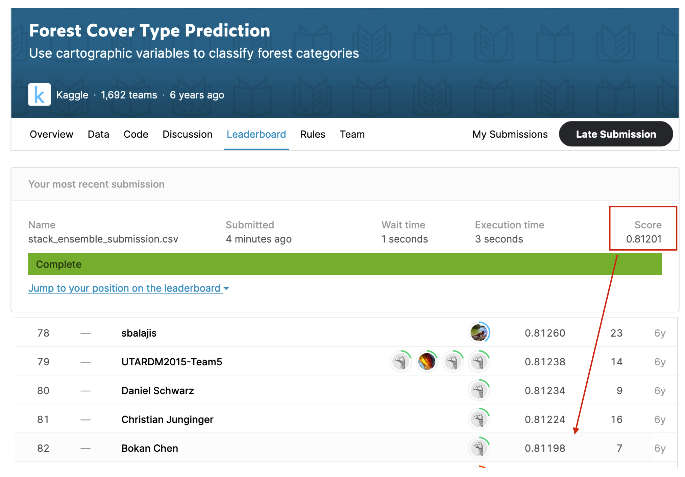

# EC2021 AutoGluon Notebook 

[](https://mybinder.org/v2/gh/sxjscience/EC2021_autogluon_notebook/HEAD?filepath=Xingjian_Shi_01_Automated_Machine_Learning_for_Earth_Science_via_AutoGluon.ipynb)


Notebook that demonstrates the usage of [AutoGluon](https://github.com/awslabs/autogluon) at [EarthCube 2021](https://www.earthcube.org/2021-earthcube-annual-meeting).

You may learn how to use AutoGluon via the notebook in [Notebook](./Xingjian_Shi_01_Automated_Machine_Learning_for_Earth_Science_via_AutoGluon.ipynb).

To train a model for [Forest Cover Type Prediction](https://www.kaggle.com/c/forest-cover-type-prediction/overview), you can try the following command.

```bash
wget https://deep-earth.s3.amazonaws.com/datasets/earthcube2021_demo/forest-cover-type-prediction.zip -O forest-cover-type-prediction.zip
unzip -o forest-cover-type-prediction.zip -d forest-cover-type-prediction
```

This will generate a file named `stack_ensemble_submission.csv` and a model that is saved to `forest_cover_ensemble`. 
We used the same script to reach 82/1692 in the competition. The screenshot for our previous run is provided in the following figure.



Feel free to checkout our website: https://auto.gluon.ai/

